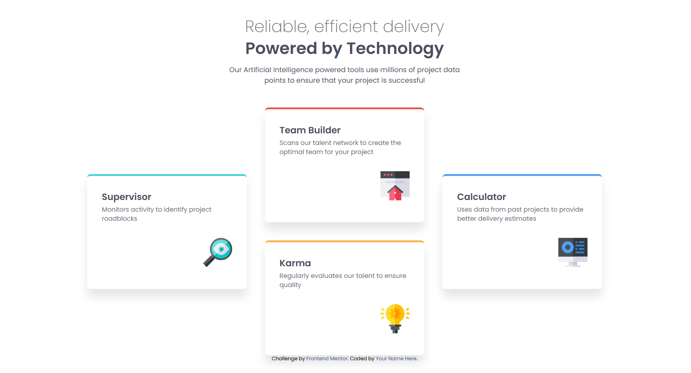

# Frontend Mentor - Four card feature section solution

This is a solution to the [Four card feature section challenge on Frontend Mentor](https://www.frontendmentor.io/challenges/four-card-feature-section-weK1eFYK). Frontend Mentor challenges help you improve your coding skills by building realistic projects.

## Table of contents

- [Overview](#overview)
  - [The challenge](#the-challenge)
  - [Screenshot](#screenshot)
  - [Links](#links)
- [My process](#my-process)
  - [Built with](#built-with)
  - [What I learned](#what-i-learned)
  - [Continued development](#continued-development)
  - [Useful resources](#useful-resources)
- [Author](#author)

**Note: Delete this note and update the table of contents based on what sections you keep.**

## Overview

### The challenge

Users should be able to:

- View the optimal layout for the site depending on their device's screen size

### Screenshot

### Links

- Solution URL: [Add solution URL here](https://github.com/denissoboslai13/frontend-mentor-four-card-section/blob/main/index.html)
- Live Site URL: [Add live site URL here](https://denissoboslai13.github.io/frontend-mentor-four-card-section/)

## My process

### Built with

- Semantic HTML5 markup
- Flexbox
- Mobile-first workflow
- Tailwind CSS

### What I learned

Okay, this one wasnt so bad in the end, but getting the layout right, and whether to use grid or flexbox definitely took more time than it shouldve. I think aside from that its pretty alright although the desktop layout still took some time to get right.

### Continued development

I think i want to keep working with flexbox and grid to really fully understand how they work, since they define the actual layout of your pages, and thats really important.

### Useful resources

- [Tailwind Docs](https://tailwindcss.com/) - Tailwind docs, mainly now used to find specific font weights, or what the specific breakpoints are.
- [Tailwind Shadow Generator](https://folge.me/tools/tailwind-shadow-generator) - Once again i had to resort to using this shadow generator, works really well for me, despite the fact that the shadows dont match up as well as i wouldve liked to the original.

## Author

- Frontend Mentor - [@denissoboslai13](https://www.frontendmentor.io/profile/denissoboslai13)
